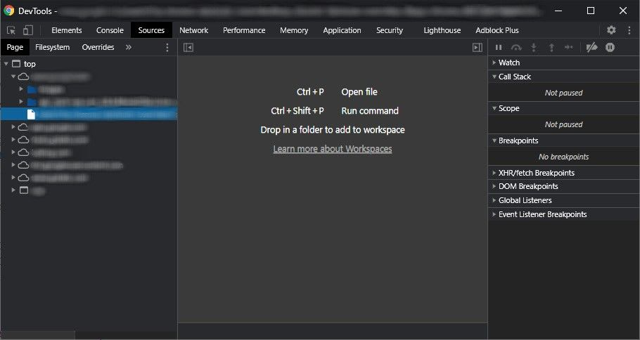
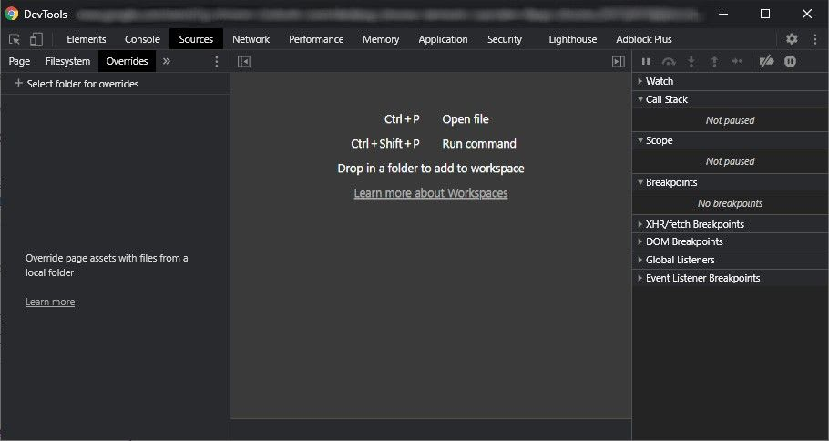
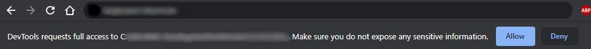
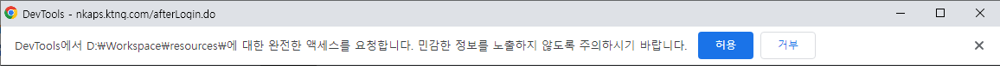
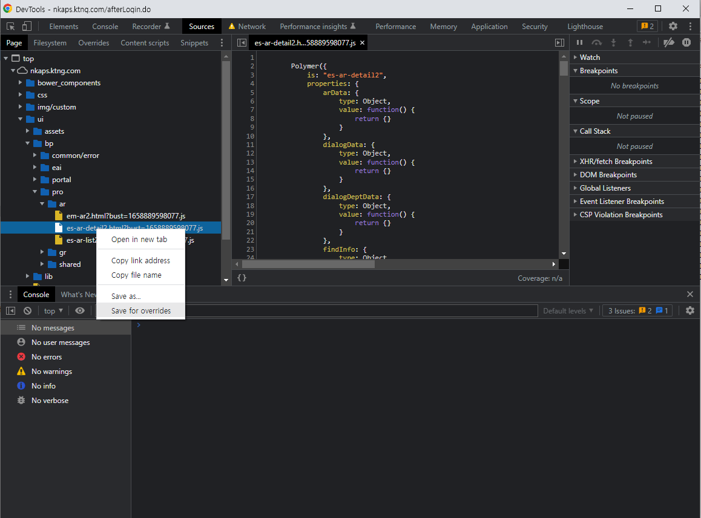
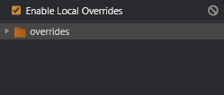

# DevTools Overrides

Chrome Devtools(개발자도구)에는 더 쉽고 빠르게 테스트, 디버깅 및 개발하는 데 도움이 되는 많은 도구가 포함되어 있다.

개발자가 익숙하지 않거나 자주 사용하지 않는 기능이 많이 있다. 이러한 기능 중 하나가 Overrides(재정의)이다.

## What is Overrides: 재정의란?

Overrides는 웹사이트의 모든 자산을 재정의하고 Javascript 또는 CSS 파일과 같은 자산을 변경할 수 있도록 도와주는 devtools의 기능이다.

웹사이트에서 사용하는 파일을 재정의하고 웹사이트에서 즉시 변경 사항을 확인할 수 있다.

---

## Why Use Overrides: 재저의를 사용하는 이유

웹사이트를 디버깅할 때 많은 사람들이 페이지 패널의 소스 패널에서 편집하여 무언가를 빠르게 테스트한다. 이는 경우에 따라 도움이 될 수 있지만 변경사항은 영구적이지 않다.

페이지를 새로고침하면 변경 사항이 사라진다. 따라서 여러 페이지에서 또는 특정 페이지를 로드할 때 무언가를 테스트하거나 디버깅하는 경우 이 방법은 작동하지 않는다.

Overrides는 devtools가 열려 있는 동안 지속된다. 파일을 재정의하고 변경하면 페이지를 다시 로드하거나 다른 페이지로 전환한 후에도 변경 사항이 유지된다.

Overrides는 프로덕션에서만 발생하는 웹사이트 또는 크롬 확장 프로그램의 버그를 디버깅할 때 매우 유용할 수 있다. 이를 수행하는 다른 방법은 번거롭거나 비효율적일 수 있다.

---

## How to Use Overrides재정의를 사용하는 방법
To use Overrides, open the Devtools either from the settings or using the keyboard shortcut `CTRL + SHIFT + I` or `F12`.

Overrides를 사용하려면 설정에서 또는 키보드 단축키를 사용하여 Devtools를 연다.

Then, Click on the **Sources** tab. You'11 see at the top of the left menu 3 tabs: **Page, Filesystem**, and **Overrides**.

Click on **Overrides**. Below it you will see **"Select folder for overrides."**
Click on it and choose a folder. This folder will store all the overrides you make.

Once you select a folder, a prompt will show up at the top of the page. Click **Allow**

When you do, you are ready to use overrides on this website. You can go back to the devtools **Sources** tab, then click on **Page**.

Choose a file like a JavaScript or CSS files, right click it and choose **"Save for overrides."**
Then file you choose will now appear in the Overrides tab.

Now, any changes you make to the file will persist throughout page feloads and navigating pages in the website as long as the devtools in running.

To stop overriding files on the website, go to the **Overrides** page again and click on the icon for **"Clear configuration"** and the overrides will be gone.

---
